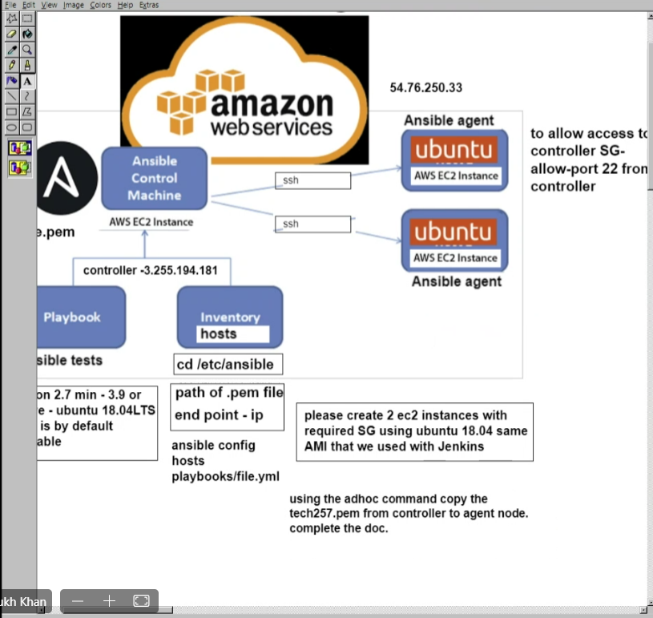
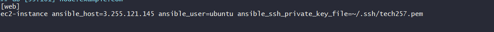

# Ansible Controllers and Agents

## Ansible

- Run scripts called a playbook
- Need to learn YAML
    - Human readable
    - Anyone can learn it
    - Python dependencies uses Python in the background
- Benefits:
    - Agentless don’t need to install any software to run or write it locally, can just install and run on the master node.

1. Create 2x EC2 instances - one controller and one agent make sure they're open to port 22 so the controller can ssh into the agent.
2. On the controller run the following after the update and upgrade:
   - `sudo apt-get install software-properties-common`
   - `sudo apt-add-repository ppa:ansible/ansible`
   - in host file `ec2-instance ansible_host=3.255.121.145 ansible_user=ubuntu ansible_ssh_private_key_file=~/.ssh/tech257.pem`
    - host has to be app agent ip
    - key files `<path to your private key>`
3. Add your agents IP to the hosts folder
    
4. Use the adhoc command to copy our ssh key from our controller to our agent:
    - `sudo ansible web -m ansible.builtin.copy -a "src=~/.ssh/tech257.pem dest=~/.ssh/"`

`sudo apt-get install software-properties-common`

`sudo apt-add-repository ppa:ansible/ansible`

`sudo apt update -y`

`sudo apt install ansible -y`

- Before running scripts on agent machines always run update and upgrade on them! 

## adhoc commands
- ping all the hosts in the hosts file:
    `sudo ansible all -m ping`

- ping all the hosts in the inventory file and display the output in super verbose mode.
    `sudo ansible all -m ping -vvvv`

- run the uname -a command (this will display the system information) on all the hosts in the inventory file:
    `sudo ansible web -a "uname -a"`

- run the date command on all the hosts in the inventory file.
    `sudo ansible all -a "date"`

- run the free command on all the hosts in the inventory file.
    `sudo ansible all -a "free"`

- run the ls -a command on all the hosts in the inventory file.
    `sudo ansible all -a "ls -a"`

- To test the syntax of the playbook:
    `sudo ansible-playbook playbook.yml --syntax-check`

- To check mongodb status on db vm:
    `sudo ansible db -a "systemctl status mongodb"`