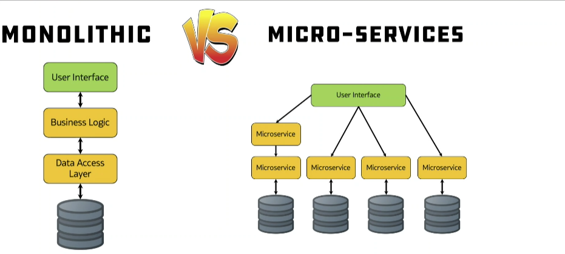

# Microservices
- One of the tools we'll be using is Docker and to scale this we'll use Kubernetes.  

 

- Monolith = Single Tier Architecture
- If Microservice goes down then K8 can replace with a healthy one - self healing.
- Have multiple containers, each looking after one specific thing and have them able to communicate with each other to create a microservice architecture.
- Need to know YAML.
- When to use Microservices:
    - If the application needs to be scalable - number of users, amount of traffice etc.